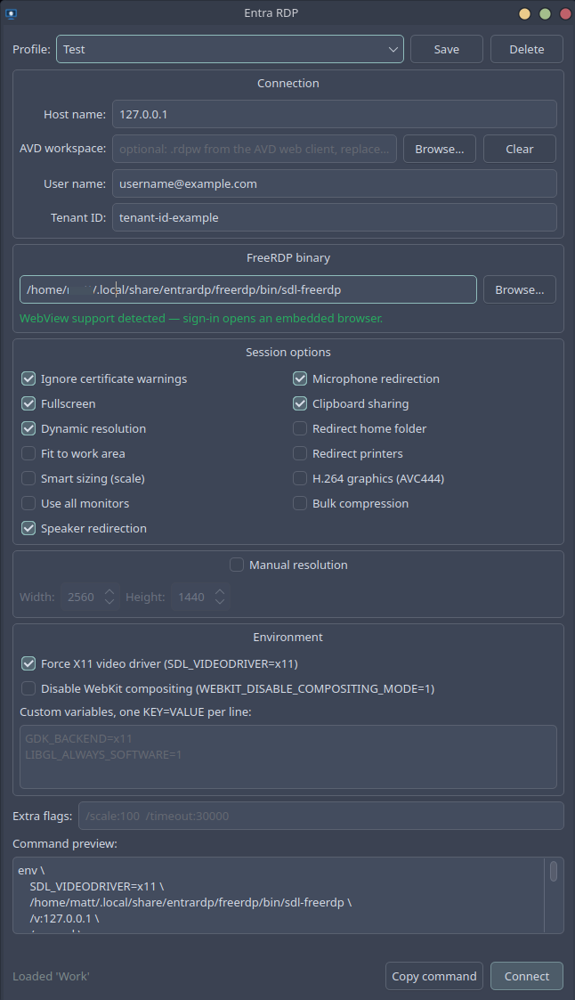

# Entra RDP

A desktop app for connecting to **Microsoft Entra ID (Azure AD) joined Windows machines** from Linux, with native web account sign-in — the equivalent of the *"Use a web account to sign in to the remote computer"* checkbox in Windows' `mstsc.exe`.



---

## The problem this solves

Distribution packages generally enable everything Entra sign-in needs **except one flag**. On Fedora 44:

```console
$ /usr/bin/sdl-freerdp /buildconfig | tr ' ' '\n' | grep -iE 'WITH_AAD|WITH_PULSE|WITH_SSO_MIB|WITH_WEBVIEW'
WITH_AAD=ON
WITH_PULSE=ON
WITH_SSO_MIB=ON
WITH_WEBVIEW=OFF
```

`WITH_WEBVIEW=OFF` is the whole problem. Without it, signing in degrades to a copy-and-paste ritual: the client prints a login URL, you open it in a browser, sign in, then paste the redirect URL back into the terminal. With it, a browser window opens inside the app and sign-in just works.

This is not distribution carelessness. FreeRDP pulls its webview helper (`akallabeth/webview`) via CMake FetchContent at configure time, and packaging policies commonly forbid fetching sources during a build. Enabling it in a package would require that helper to be packaged independently first.

Support landed upstream in **FreeRDP 3.16.0**, so anything older cannot have it regardless of configuration. Newer packages vary — run the check above on your own system before compiling anything.

Both builds are named `sdl-freerdp`. **Name equality is not build equality** — which is why this app probes the binary it is about to run and tells you which one you have before you connect.

---

## Platform support

| Platform | Status |
|---|---|
| **Fedora 44** | Tested end to end |
| Other Fedora / RHEL / derivatives | Should work; same `dnf` package list |
| Debian / Ubuntu | **Untested.** An `apt` list exists but has not been verified |
| Arch | **Untested.** A `pacman` list exists but has not been verified |
| openSUSE, Void, Gentoo, NixOS | No automatic dependency install. Use `SKIP_DEPS=1` |
| Snap | Not supported |
| Flatpak | Manifest present but **not yet built or published** |

On any distribution, the preflight check verifies prerequisites through `pkg-config` before compiling, so an incorrect package list produces a precise list of what is missing rather than an obscure build failure. On an untested platform, expect to install one or two packages by hand:

```bash
SKIP_DEPS=1 ./scripts/build-freerdp.sh
```

Reports of what was actually needed on your distribution are welcome — the untested lists only improve that way.

**A distribution-agnostic Flatpak is the intended long-term answer**, since it bundles a webview-enabled FreeRDP and removes the compile entirely. See [packaging/flatpak](packaging/flatpak/) for its current state.

---

## Install

### Flatpak

> **Not yet available.** The manifest in [packaging/flatpak](packaging/flatpak/) has not been built or submitted to Flathub, and still needs reconciling with FreeRDP's own upstream manifest. Once published it will bundle a webview-enabled FreeRDP, making this the recommended route on every distribution.

### From source

Tested on Fedora 44. See [Platform support](#platform-support) for other distributions.

```bash
git clone https://github.com/themew2/FreeRDP-to-Entra-Connected-Windows-Device.git
cd FreeRDP-to-Entra-Connected-Windows-Device
./scripts/install.sh
```

That single command does everything. Budget **10–30 minutes**, almost all of it compiling FreeRDP, and around 3 GB of disk for the source and build tree.

Only the dependency step needs `sudo`. Everything else installs under your home directory.

---

## What the scripts do

Two scripts, with distinct jobs. `install.sh` is the front door and calls the other one for you.

```
install.sh
  ├─ 1. build-freerdp.sh          compile FreeRDP with WITH_WEBVIEW=ON
  ├─ 2. python3-pip, python3-pyqt6   installed if missing
  ├─ 3. pip install                  the app, to ~/.local/bin/entrardp
  └─ 4. desktop entry, icon, AppStream metainfo
```

### `scripts/build-freerdp.sh`

Produces a FreeRDP binary that Fedora, Debian, and Arch do not ship: one compiled with `-DWITH_WEBVIEW=ON`.

| Phase | What happens |
|---|---|
| Dependencies | Detects `dnf` / `apt` / `pacman` and installs the toolchain and headers |
| **Preflight** | Verifies every prerequisite with `pkg-config` and reports *all* missing ones at once |
| Source | Shallow-clones FreeRDP to `~/.cache/entrardp/FreeRDP` |
| Configure | `-DWITH_WEBVIEW=ON -DWITH_AAD=ON -DWITH_SSO_MIB=ON -DWITH_PULSE=ON` |
| **Gate** | Aborts unless CMakeCache confirms `WITH_WEBVIEW:BOOL=ON` and `WITH_PULSE:BOOL=ON` |
| Build & install | `cmake --build`, then `--target install` |
| **Verify** | Runs `/buildconfig` on the installed binary to confirm webview is really on |

The three checks exist because the failure this script prevents is a *silent* one. CMake accepts a flag it has not yet defined without complaint, so a build can succeed, install cleanly, run fine — and simply lack the feature you asked for. Each check fails loudly at the earliest point it can.

**Installs to `~/.local/share/entrardp/freerdp`.** Your distribution's FreeRDP is never touched, and the two coexist:

| Path | Source | WebView |
|---|---|---|
| `/usr/bin/sdl-freerdp` | Distribution package | OFF |
| `~/.local/share/entrardp/freerdp/bin/sdl-freerdp` | This script | **ON** |

The app searches its own prefix first, so it picks the right one automatically.

Run it on its own when you only need the binary — for example if the GUI is already installed:

```bash
./scripts/build-freerdp.sh
```

Useful environment variables:

| Variable | Default | Purpose |
|---|---|---|
| `SKIP_DEPS=1` | off | Skip package installation; preflight still runs |
| `SKIP_PREFLIGHT=1` | off | Continue despite preflight warnings, when a library is present under an unexpected pkg-config name |
| `FREERDP_BRANCH` | `master` | Build a specific tag or branch (must be ≥ 3.16.0) |
| `ENTRARDP_PREFIX` | `~/.local/share/entrardp/freerdp` | Install somewhere else |
| `JOBS` | all cores | Limit parallel compilation |
| `WITH_SSO_MIB` | `auto` | Automatic token retrieval via a local identity broker. Enabled only if the `sso-mib` library is present; set `ON` or `OFF` to force |

### `scripts/install.sh`

The full installation. Runs `build-freerdp.sh`, then installs the GUI and registers it with your desktop.

Skip the compile if you already have a webview-enabled FreeRDP:

```bash
SKIP_FREERDP=1 ./scripts/install.sh
```

Then point the app at your binary using the **Browse** button. It will tell you whether that build supports webview.

### Uninstalling

```bash
pip uninstall entrardp
rm -rf ~/.local/share/entrardp ~/.cache/entrardp
rm -f ~/.local/share/applications/io.github.themew2.EntraRDP.desktop
```

---

### Before compiling: check what you already have

An existing build may already do the job:

- **Nightly packages** install to `/opt/freerdp-nightly` and coexist with your distribution package. See [PreBuilds](https://github.com/FreeRDP/FreeRDP/wiki/PreBuilds).
- **RPM users** can build packages from the FreeRDP checkout using the scripts in its `packaging/scripts` directory.
- **Flathub** ships `com.freerdp.FreeRDP`, with a beta channel available.

Check any of them with:

```bash
<path-to-binary> /buildconfig | tr ' ' '\n' | grep -i WITH_WEBVIEW
```

`WITH_WEBVIEW=ON` means you can skip the compile entirely — use `SKIP_FREERDP=1` and select that binary in the app.

---

## Usage

Fill in three fields and press Connect:

| Field | Notes |
|---|---|
| **Host name** | Must match the Entra-registered device name **exactly**, and must resolve via DNS or `/etc/hosts`. |
| **User name** | `you@yourdomain.com` |
| **Tenant ID** | Your Entra tenant GUID, from Azure Portal → Microsoft Entra ID → Overview. |

Save the combination as a named profile to reuse it. Profiles live in `~/.config/entrardp/profiles.json`, mode `600`.

**No credentials are ever stored.** Authentication happens entirely inside the Entra webview. The app keeps only hostnames, usernames, and tenant IDs.

### Session options

Every checkbox maps to exactly one FreeRDP flag, shown in its tooltip and reflected live in the command preview. Nothing is hidden — if the app misbehaves, copy the previewed command and run it in a terminal to see the raw output.

Defaults match a verified-working configuration: fullscreen, fixed resolution, certificate bypass, audio in and out, and clipboard sharing.

### Keyboard shortcuts inside a session

These are SDL client defaults, and differ from the older `xfreerdp` client:

| Keys | Action |
|---|---|
| `Right Shift` + `Enter` | Toggle fullscreen |
| `Right Shift` + `M` | Minimize |

---

## Troubleshooting

**dnf reports an ffmpeg conflict (`libavcodec-free` vs `ffmpeg-libs`).**
Your system has RPMFusion's full ffmpeg, which conflicts with Fedora's patent-stripped `libav*-free` packages. The script requests these headers by pkg-config capability so dnf resolves to whichever you already have. If you still hit it on an older copy of the script, install `ffmpeg-devel` and re-run with `SKIP_DEPS=1`.

**Do not use `--allowerasing` to resolve this.** It would replace RPMFusion's ffmpeg with the stripped build, degrading codec support system-wide as a side effect of building an RDP client.

**`Could NOT find Wayland (missing: XKBCOMMON_INCLUDE_DIR)`.**
Install `libxkbcommon-devel` (Fedora), `libxkbcommon-dev` (Debian/Ubuntu), or `libxkbcommon` (Arch). Wayland is a required feature in FreeRDP's uwac component, so configure stops rather than disabling it. Note this is a different package from `libxkbfile`.

**cmake warns that `jansson` and `json-c` were not found.**
FreeRDP needs a JSON parser for Entra token handling. Install `jansson-devel` (Fedora), `libjansson-dev` (Debian/Ubuntu), or `jansson` (Arch).

**`The following required packages were not found: sso-mib>=0.5.0`.**
Only happens if you forced `WITH_SSO_MIB=ON` without the library installed. The default is `auto`, which detects it and builds without it when absent. It is optional and unrelated to webview sign-in — install `sso-mib-devel` only if you use a local identity broker.

**The application shows a generic icon.**
Run `./scripts/diagnose-icon.sh`, which checks each step of the lookup chain.

The most common cause is a stale `icon-theme.cache`. Icon lookups trust that cache over scanning the directory, so a cache written before the icon was installed keeps reporting it absent:

```bash
rm -f ~/.local/share/icons/hicolor/icon-theme.cache
gtk-update-icon-cache -f -t ~/.local/share/icons/hicolor
kbuildsycoca6 --noincremental
```

If the menu entry is still generic, restart the shell with `systemctl --user restart plasma-plasmashell`, which is quicker than logging out.

A second cause is a missing `~/.local/share/icons/hicolor/index.theme`. A directory without one is not a valid icon theme, so lookups skip it and a correctly installed icon never resolves. `install.sh` now creates it. Fix an existing installation with:

```bash
cp /usr/share/icons/hicolor/index.theme ~/.local/share/icons/hicolor/
kbuildsycoca6 --noincremental
```

Note that on Wayland there is no per-window icon: the compositor matches the window's `app_id` to a desktop entry and reads its `Icon=` line. `QIcon.setWindowIcon` and `StartupWMClass` affect X11 only.

**Preflight reports a library as missing that you know is installed.**
pkg-config file names differ between distributions. Find the real name with `pkg-config --list-all | grep -i <library>`, then either re-run with `SKIP_PREFLIGHT=1` or open an issue with the name so it can be added to the list.

**`/usr/bin/python3: No module named pip`.**
Some distributions do not install pip with Python. `install.sh` now handles this, but to do it by hand: `sudo dnf install python3-pip python3-pyqt6`.

**`error: externally-managed-environment`.**
The system Python is marked externally managed (PEP 668). `install.sh` retries automatically with `--break-system-packages`, which only affects `~/.local`, never system packages.

**The app finds `/usr/bin/sdl-freerdp` and warns about WebView.**
Expected before you have run `build-freerdp.sh`. Binaries are deliberately never taken from a CMake build directory, per upstream guidance, so a build tree at `~/FreeRDP/build/...` will not be detected. Either run `./scripts/build-freerdp.sh` to install into the private prefix, or use **Browse** to select a binary explicitly.

**Sign-in prints a URL instead of opening a browser window.**
Your FreeRDP binary lacks webview support. The *FreeRDP binary* section will say so in orange. Either run `./scripts/build-freerdp.sh`, or browse to a build made with `WITH_WEBVIEW=ON`.

**`Cannot find KDC for realm`.**
`/sec:aad` is missing. The app always sets it, so this points at a stale profile or something in *Extra flags* overriding it.

**Command line parsing failed at 'azure'.**
A quote character got pasted into a field. The app strips these automatically now; if you see it, check *Extra flags*.

**Horizontal line artifacts on Wayland.**
Smart sizing combined with fullscreen is a FreeRDP SDL3 rendering bug, tracked upstream as [FreeRDP#13204](https://github.com/FreeRDP/FreeRDP/issues/13204). The app warns when both are enabled — use a fixed resolution with fullscreen instead.

**The sign-in window never appears on Wayland.**
Leave *Force X11 video driver* enabled. The webview popup does not map reliably on native Wayland.

**Host does not resolve.**
The app warns before connecting. Entra-joined machines often aren't in corporate DNS; add an `/etc/hosts` entry.

---

## Building the Flatpak locally

```bash
flatpak install -y flathub org.gnome.Sdk//48 org.gnome.Platform//48 \
    com.riverbankcomputing.PyQt.BaseApp//6.7
flatpak-builder --user --install --force-clean build-dir \
    packaging/flatpak/io.github.themew2.EntraRDP.yml
flatpak run io.github.themew2.EntraRDP
```

The manifest uses the **GNOME runtime** rather than KDE, because FreeRDP's webview helper requires WebKitGTK, which GNOME's runtime ships and KDE's does not. Qt arrives via the PyQt BaseApp extension.

---

## Project layout

```
src/entrardp/
    config.py     Flag definitions, input sanitizing, profile storage
    freerdp.py    Binary discovery, webview detection, command assembly
    gui.py        PyQt6 interface
scripts/
    build-freerdp.sh   Compiles FreeRDP with WITH_WEBVIEW=ON, with
                       preflight dependency checks and post-build verification
    install.sh         Calls build-freerdp.sh, then installs the GUI
                       and registers the desktop entry
packaging/flatpak/     Flatpak manifest
data/                  Desktop entry, AppStream metainfo, icon
```

---

## The original guide

The step-by-step build walkthrough this project grew out of is preserved at
[docs/BUILD-GUIDE.md](docs/BUILD-GUIDE.md), along with the original `rdp-aad.sh`
wrapper script. Useful if you would rather understand each step than run a script.

## Credits

Built on [FreeRDP](https://github.com/FreeRDP/FreeRDP). The build recipe originated from working out webview-enabled Entra authentication on Fedora and Nobara; see [FreeRDP#13201](https://github.com/FreeRDP/FreeRDP/issues/13201).

## License

Apache-2.0, matching FreeRDP.
